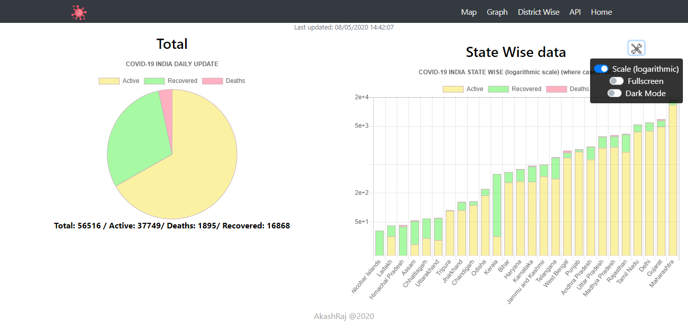

# COVID-19 Dashboard In React

### Live at [https://akashraj.tech/corona/interactive/](https://akashraj.tech/corona/interactive/)

## Output
> 
> 
> 
> 
# Important note:
 - Change the ``install_directory`` variable in ``App.js`` according to the directory in which you'll be serving this project. Set directory relative to root of your server (for ``Heroku`` use ``/``)
 - 3 options are Available for map configuration  in ``src/corona-2/components/Map.js  in setup_chart()`` toggle them according to your preference
  
        let enable_cirlce = true; 
        let enable_legend = true;
        let enable_tooltip = true;
        let max_cirlce_size=50;
        let min_cirlce_size=2;
    
 - Then build the project with ``npm run build``
 - Serve the content of ``/build`` directory 

## Available Scripts

In the project directory, you can run:

### `npm start`

Runs the app in the development mode. 
Open [http://localhost:3000](http://localhost:3000) to view it in the browser.

The page will reload if you make edits. 
You will also see any lint errors in the console.

### `npm run build`

Builds the app for production to the `build` folder. 
It correctly bundles React in production mode and optimizes the build for the best performance.

The build is minified and the filenames include the hashes. 
Your app is ready to be deployed!

