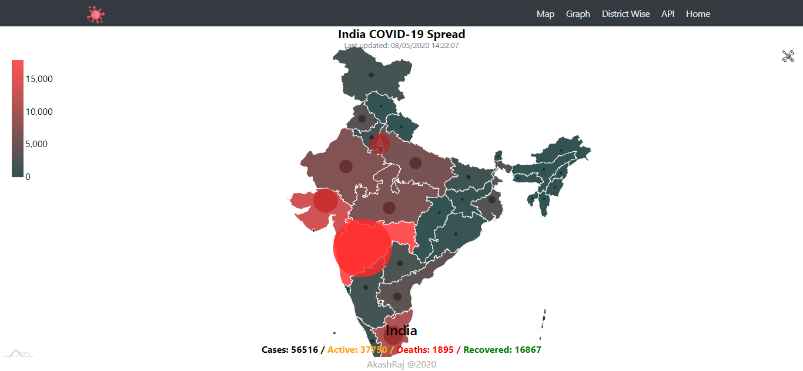

# COVID-19 Dashboard In React

### Live at [https://akashraj.tech/corona/interactive/](https://akashraj.tech/corona/interactive/)

## Output
> 
> 
> 
> 
# Important note:
 - Change the ``install_directory`` variable in ``App.js`` according to the directory in which you'll be serving this project. Set directory relative to root of your server (for ``Heroku`` use ``/``)

 - Build the project with ``npm run build``
 - Serve the content of ``/build`` directory 

## Available Scripts

In the project directory, you can run:

### `npm start`

Runs the app in the development mode. 
Open [http://localhost:3000](http://localhost:3000) to view it in the browser.

### `npm run build`

Builds the app for production to the `build` folder. 
It correctly bundles React in production mode and optimizes the build for the best performance.

> # Project Tree

       .
       |-- README.md
       |-- deploy.sh                             
       |-- key.pem.enc
       |-- package.json
       |-- public
       |   |-- data
       |   |   |-- india_map.json              
       |   |   |-- india_map_dict.json          
       |-- src
       |   |-- App.css
       |   |-- App.js
       |   |-- Component
       |   |   |-- Footer.js
       |   |   `-- Menu
       |   |       |-- Menu.js
       |   |       |-- MenuItem.js
       |   |       `-- index.js
       |   |-- Pages
       |   |   |-- Graph
       |   |   |   |-- Table
       |   |   |   |   |-- SubTable.js
       |   |   |   |   |-- Table.js
       |   |   |   |   |-- TableOnly.js
       |   |   |   |   `-- TableRow.js
       |   |   |   |-- components
       |   |   |   |   |-- CardItem.js
       |   |   |   |   |-- Graph.js
       |   |   |   |   |-- GraphDataOptions.js
       |   |   |   |   |-- GraphDataTimelineOptions.js
       |   |   |   |   `-- GraphDataTotalOptions.js
       |   |   |   `-- index.js
       |   |   `-- Map
       |   |       |-- Content.js
       |   |       |-- components
       |   |       |   |-- InfoBar.js
       |   |       |   |-- Map.js
       |   |       |   `-- Timeline.js
       |   |       `-- index.js
       |   |-- Switch.css
       |   |-- index.css
       |   |-- index.js
       |   |-- logo.svg
       |   `-- utils
       |       `-- CookieHelper.js

